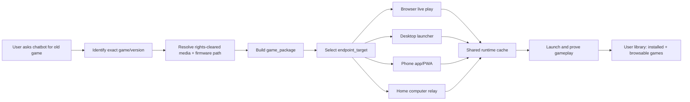

# Classic Game Endpoint Delivery

## Status

Working note for the Scorched Tanks proof branch. Promote into `PLAN.md`
after the current `PLAN.md` write claim clears.

## Context

The Scorched Tanks browser proof is one output, not the whole product. A user
may ask from a phone, a personal computer, a work computer, a shared machine,
or a web-only chat. The desired result depends on device authority and user
intent:

- Work/shared computer at lunch: instant browser play, no install.
- Personal computer with local agent authority: install a desktop launcher.
- Personal phone: install a phone app/PWA launcher.
- Phone away from home computer: queue install to the home computer if a relay
  or local app is reachable; otherwise return a durable browser result.

The branch therefore needs reusable primitives, not per-game special cases.

## Primitive

Use a three-part delivery contract:

1. `game_package`: rights-cleared media, patches, launch metadata, proofs, and
   provenance for one game/version.
2. `runtime_package`: shared emulator/runtime such as PUAE, DOSBox, BasiliskII,
   SheepShaver, ScummVM, MAME, vAmiga/SAE, or a source port. Installed once per
   endpoint and reused by many games.
3. `endpoint_target`: browser session, phone app/PWA, desktop launcher, home
   computer relay, or hosted live state. It owns install authority, storage
   budget, and launch surface.

No game package may bundle a full runtime repeatedly when the endpoint can
reuse an existing runtime package. Runtime updates are one-version/additive by
default so 100 DOSBox games do not produce 100 DOSBox installs.

## Branch Implications

The Scorched browser proof should leave behind reusable primitives, even while
it is still only one game:

- Runtime catalog: one manifest entry per shared emulator/runtime, with version,
  license, platform support, cache/install size, and supported endpoint targets.
- Game package manifest: game media provenance, patch recipe, runtime
  requirements, launch parameters, input map, audio requirement, and exact
  playability proof.
- Endpoint capability probe: records whether the current user path is anonymous
  browser, logged-in browser, desktop app/agent, phone app/PWA, enterprise
  managed browser, or phone-to-home relay.
- Install intent: a durable request to install later on a capable endpoint when
  the current endpoint can only offer hosted browser play.
- User library entry: one canonical game entry can have multiple outputs:
  browser play, desktop launcher, phone launcher, queued home install, and
  compatibility/remix fallback.

The branch should optimize the browser output now, but code and metadata should
not assume browser is the only product. Browser is one `endpoint_target`.

## Capability Graph

## Endpoint Matrix

| User situation | Preferred output | Fallback |
| --- | --- | --- |
| Browser-only, not logged in | Hosted browser play URL | Save public result; ask user to resume from a capable client only if install is requested |
| Browser-only, logged in | Hosted browser play plus saved library entry | Queue install intent for a later connected device |
| Work/shared computer | Hosted browser play with no local install | Temporary session only |
| Personal computer with local agent/app | Desktop shortcut or native launcher | Browser launcher |
| Phone app with install authority | Phone PWA/app launcher and saved library | Hosted browser play |
| Phone while home computer is reachable | Queue install to home computer and notify when ready | Phone browser/PWA play |
| Phone while home computer is offline | Durable queued install intent | Browser/PWA play now |

## Capability Horizon

Verified 2026-05-01:

- Browser/PWA is a current general path for instant play and optional
  home-screen/app-launcher presence. It is not general authority to write a
  desktop shortcut or install native runtimes silently.
- Browser file access is permissioned and sandboxed. Use it for user-selected
  game media or export/import flows, not as a hidden installer surface.
- Native desktop shortcuts, phone apps, and phone-to-home-computer installs
  require an `endpoint_target` with explicit local authority: a local app,
  OS install bridge, MDM/enterprise channel, app-store install, or authorized
  relay. A web chat alone should create a durable intent plus browser play now.
- Six-month planning should use feature detection and endpoint negotiation,
  not promises. Chrome Isolated Web Apps and related packaging work may grow,
  but current public documentation still frames initial IWA installation around
  managed ChromeOS enterprise deployment.

Reference points: MDN PWA installability
(`https://developer.mozilla.org/en-US/docs/Web/Progressive_web_apps/Guides/Making_PWAs_installable`),
MDN File System API
(`https://developer.mozilla.org/en-US/docs/Web/API/File_System_API`), Apple
Home Screen web app manifest flow
(`https://developer.apple.com/documentation/browserenginekit/bewebappmanifest`),
and Chrome Isolated Web Apps
(`https://developer.chrome.com/docs/iwa/introduction`).

## Scorched Tanks Application

For this branch:

- `game_package`: Scorched Tanks v1.75 from Amiga Power #41 disk 2, plus exact
  provenance and any autostart-only disk patch.
- `runtime_package`: browser Amiga runtime that probes an optional hosted
  licensed Kickstart entitlement first, falls back to AROS when absent, and
  accepts a local user-owned Kickstart file without bundling proprietary ROMs.
- `endpoint_target`: browser live play first. Later desktop/phone outputs must
  reuse the same game package and runtime manifest rather than forking the
  Scorched-specific launcher.

Current proof state, verified 2026-05-02:

- The browser output is valuable and should remain the first anonymous/work
  device output.
- The launcher now fills the tab, mounts media once, unlocks audio after a user
  gesture, and avoids the previous reset loop.
- Launcher routing was browser-verified with
  `node output\online-research\verify-scorched-launcher-routing.mjs`: default
  `auto` probes the hosted licensed Kickstart path and falls back to bundled
  AROS on 404; strict `?firmware=hosted-kickstart` fails loudly when the hosted
  ROM is absent; a provisioned hosted ROM injects as Kickstart without fetching
  AROS. This is a capability proof, not gameplay proof.
- AROS reaches the Scorched Tanks v1.75 title/legal screen, but the original
  runtime black-screens before gameplay after input or extended wait.
- The documented A1200 2 MB chip + 4 MB fast profile was tested and still
  black-screened, so the active blocker is AMOS/AROS compatibility rather than
  only memory sizing.
- The GameBase v1.90 fixed ADF matches a Kickstart 1.3, OCS, 512K chip +
  512K slow-memory recipe, but under bundled AROS it still returns to Workbench
  or trips AMOS heap/free-list corruption before gameplay.
- PlanetEmu v1.77 reaches the same AMOS `0x0100000F` failure family under
  AROS, so the blocker spans original releases rather than a single bad ADF.
- A Workbench diagnostic with a second `ENV:` floppy removes the `ENV`
  requester, but still opens an empty ScorchedTanks window instead of exposing
  executable icons or starting gameplay.
- The GameBase MDB also lists a WHDLoad route for v1.90 using
  `generickick31.slave custom=scorchedtanks PRELOAD`. Official WHDLoad
  GenericKick documentation still requires original Kickstart images for
  KickEmu, so this is a licensed-firmware capability path, not a free AROS
  proof.
- Cloanto/Amiga Forever's RP9/Game Pack listings include Scorched Tanks, so a
  commercial entitlement integration may be a cleaner future primitive than a
  loose ROM file picker. This branch cannot bundle or assume that entitlement;
  it can only expose a user/host-supplied licensed firmware/media path until
  an approved integration exists.
- AMOS-for-Windows proves AMOS Professional itself can boot under free AROS in
  WinUAE 2.3.2, but the same WinUAE+AROS setup still fails Scorched Tanks
  v1.90 with `0x0100000F - Memory header not located`. Removing Fast RAM and
  using 4 MB Chip either exposes the same alert on the no-EndCLI diagnostic or
  black-screens after Continue, so simple alert suppression is not a playable
  compatibility path.
- Browser SAE with the older AMOS-for-Windows AROS ROM/ext was rerun with
  ROM-hash-qualified proof names (`aros-amiga-m68k-rom-9557fd50`) to prevent
  same-basename evidence collisions. It fails before gameplay in reset loops:
  v1.77 A500 reset 10 times in 90s, v1.77 A1200 reset 21 times in 90s, and
  v0.95 A500 reset 10 times in 90s. Screenshots are flat non-game canvases.
- A v1.77 two-disk shim that adds the legal AMOS-for-Windows `amos.library` to
  `LIBS:` does not fix the failure family. A500 512K chip + 512K slow still
  reports not enough memory, and A500 1 MB chip + 2 MB fast still raises
  `0x0100000F - Memory header not located`.
- The official AROS 2026-04-28 nightly `aros-amiga-m68k-rom.bin` and
  `aros-ext.bin` match the bundled AROS assets byte-for-byte. There is no newer
  upstream AROS nightly fix to test from that source right now.
- The older v0.95 shareware ADF runs its own startup, but A500-style AROS
  reports not enough memory. Larger chip/fast profiles black-screen or abort
  in SAE memory mapping instead of reaching gameplay.
- EmulatorJS/PUAE with A500/OCS/AROS fallback reaches Workbench only for the
  GameBase v1.90 diagnostic ADF.
- vAmigaWeb's own ROM path expects a compatible Kickstart injection for many
  programs that fail under AROS. The branch can now route to that primitive, but
  exact playability still needs a rights-cleared Kickstart file and gameplay
  proof on this Scorched media.

Acceptance remains the exact-game proof: launch, input, audio, and a visible
tank hit in the original runtime.
